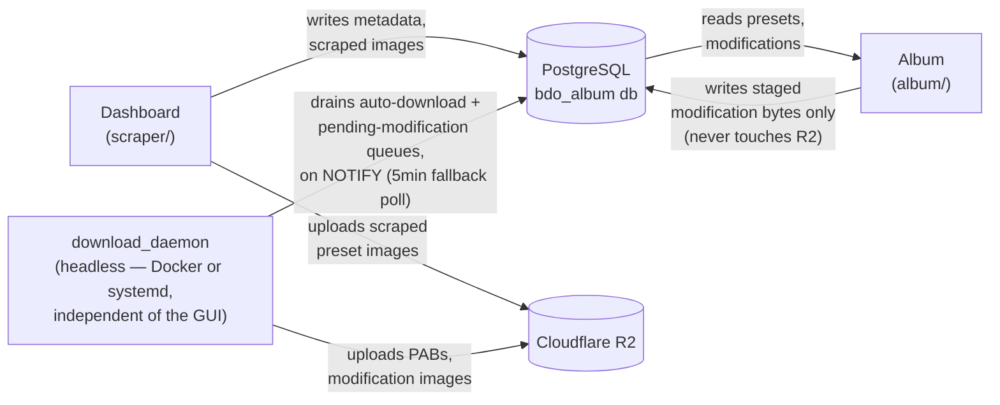

# BDO Album

A two-app desktop suite for browsing and curating Black Desert Online "Beauty Album" character presets, built with [Tauri 2](https://tauri.app/) and [Svelte 5](https://svelte.dev/).

- **[Dashboard](scraper/)** — scrapes popular presets from [Garmoth](https://garmoth.com), uploads preset images to Cloudflare R2, and writes metadata to PostgreSQL. Also ships a headless background worker (`download_daemon`) that keeps running independently of the GUI — see [Background workers](#background-workers-scraper) below.
- **[Album](album/)** — reads the same PostgreSQL database and lets the user browse presets, manage favorites/discards, attach personal "modifications" (before/after images) to a preset, and import them onto their own in-game characters (via face grid).

The two apps are fully independent Tauri/Rust projects (no shared crate or workspace); they only share a Postgres database and an R2 bucket. **Album never talks to R2 directly** — every R2 write, including user-submitted modification images, goes through the Dashboard side (either its live scraping session or the `download_daemon` background worker), with Postgres as the only channel between the two apps.

## Architecture



- **Frontend**: Svelte 5 (runes), TypeScript, SCSS, Vite
- **Backend**: Rust, Tauri 2, `sqlx` (PostgreSQL)
- **Scraping**: `playwright-rs` (headless Chromium) to get past Cloudflare's JS challenge on Garmoth
- **Storage**: PostgreSQL for metadata, Cloudflare R2 for preset images
- **Auto-update**: Tauri updater plugin, manifests published as GitHub Release assets

### Background workers (scraper)

`download_daemon` (`scraper/cli/src/bin/download_daemon.rs`) is a long-running, GUI-free
worker that drains two independent queues as soon as Album queues something — via
Postgres `LISTEN`/`NOTIFY` — with a 5-minute fallback poll in case a notification is missed:

- **Auto-download** — PABs for presets the Album user marked "wanted" (`album_user_prefs.auto_download_requested_at`), fetched via an authenticated Garmoth session.
- **Preset modifications** — images the Album user pasted onto a preset (staged in `album_pending_preset_modifications`, since Album itself never touches R2), uploaded to R2 and moved into `album_preset_modifications`.

It runs two ways:

- **Alongside the Windows GUI** — spawned automatically when the Dashboard app starts (`scraper/src-tauri/src/lib.rs`), no separate process to manage.
- **Standalone on a headless Linux host** — same binary, no GUI/display required. Production runs this via Docker (`scraper/Dockerfile`, builds both `scrape` and `download_daemon`); a bare-metal/systemd alternative is documented in [`scraper/cli/systemd/README.md`](scraper/cli/systemd/README.md).

Both paths need the same Garmoth session file (`garmoth_auth.json`, exported once from the Windows GUI) for the auto-download half — the preset-modifications half needs nothing beyond the usual `DATABASE_URL`/R2 credentials.

## Getting started

### Prerequisites

- [Rust](https://www.rust-lang.org/tools/install) (stable)
- [Node.js](https://nodejs.org/) 22+ and [pnpm](https://pnpm.io/)
- [Docker](https://www.docker.com/) (for local PostgreSQL)

### Infrastructure

```bash
docker compose up -d   # PostgreSQL on localhost:5432
```

### Environment variables

Each app reads its own `src-tauri/.env` (gitignored). See [scraper/src-tauri/.env.example](scraper/src-tauri/.env.example) and [album/src-tauri/.env.example](album/src-tauri/.env.example) for the required keys (database connection string, plus R2 credentials for the scraper).

### Database schema

Migrations (in `scraper/src-tauri/migrations/`) are **not** applied automatically when the app starts — run them explicitly whenever you pull new schema changes:

```bash
pip install psycopg2-binary
python scripts/migrate.py   # reads DATABASE_URL from scraper/src-tauri/.env
```

No Rust/sqlx-cli involved — it's a standalone script that tracks applied migrations in `_sqlx_migrations` (same table/checksum scheme sqlx itself uses) and refuses to proceed if an already-applied migration's file changed underneath it.

### Playwright driver bootstrap CLI (scraper only)

The scraper bundles a small `playwright-rs` CLI binary in its installer, which it shells out to on first run to fetch the actual Playwright driver into the user's cache — see [TODO.md](TODO.md). Build it once (also required before `tauri build`/`pnpm tauri:build`, since the MSI resource has to exist on disk):

```bash
cargo install playwright-rs --version 0.15.0 --locked --features cli --root scraper/src-tauri/tools/playwright-rs-cli --bin playwright-rs
```

### Run

```bash
# Dashboard / scraper
cd scraper
pnpm install
pnpm tauri dev

# Album viewer
cd album
pnpm install
pnpm tauri dev
```

## Building & releasing

Releases are built by [`.github/workflows/release.yml`](.github/workflows/release.yml). Pushing to the `releases` branch:

1. Creates a draft GitHub Release.
2. Builds both apps' Windows MSI installers in parallel jobs.
3. Publishes updater manifests (`scraper-latest.json`, `album-latest.json`) and un-drafts the release once both builds succeed.

Bump the `version` field in both `scraper/src-tauri/tauri.conf.json` and `album/src-tauri/tauri.conf.json` together before pushing to `releases` — they ship as one combined release.

### Versioning

Semantic versioning (`MAJOR.MINOR.PATCH`), one shared number for the whole suite:

- **PATCH** (`0.2.0` → `0.2.1`) — bug fixes, CI/infra changes, anything that doesn't change what the app does. Most releases are this.
- **MINOR** (`0.2.x` → `0.3.0`) — new features or a meaningfully-sized change (a new subsystem, a UI rework, a behavior change users would notice).
- **MAJOR** — not in use yet; reserve for a post-1.0 breaking change (incompatible DB schema, config format, etc.).

**Always bump before pushing to `releases`.** The Tauri updater compares version numbers, not content — pushing under an unchanged version silently ships a build nobody's app will ever detect as an update (this happened once already; see the `v0.1.0` → `v0.2.0` jump in git history).

## Known limitations

See [TODO.md](TODO.md) for open items and planned work.
